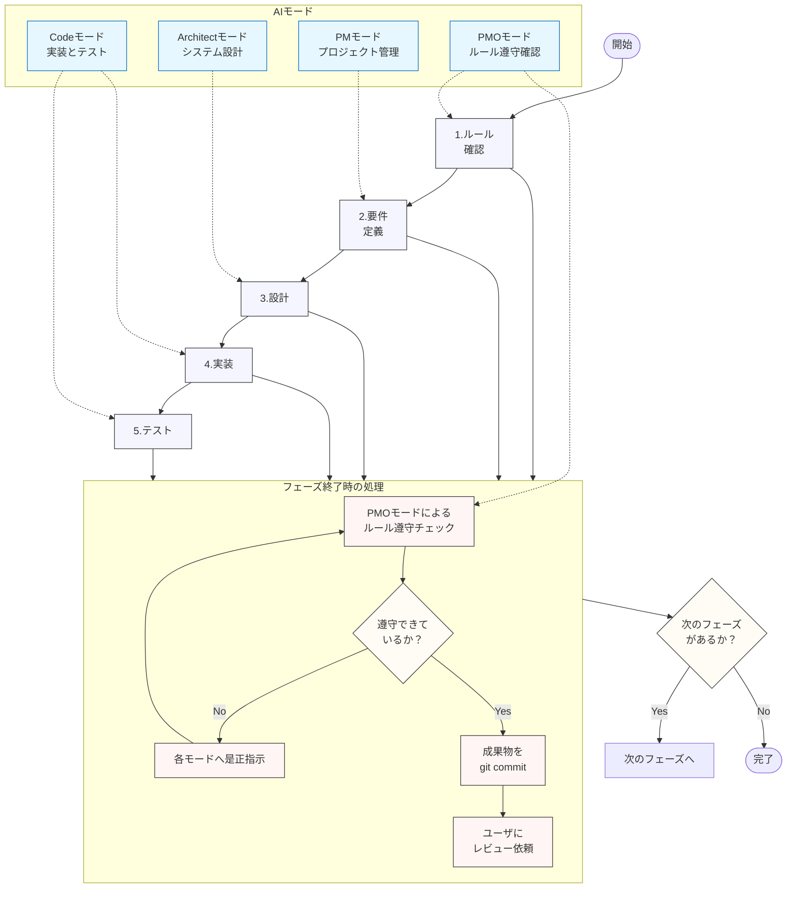

# 開発フロー図

## 全体のフロー

```mermaid
flowchart TD
    %% AIモード
    subgraph Modes [AIモード]
        direction LR
        PMMode[PMモード<br>プロジェクト管理]
        PMOMode[PMOモード<br>ルール遵守確認]
        ArchMode[Architectモード<br>システム設計]
        CodeMode[Codeモード<br>実装とテスト]
    end

    %% メインフロー
    Start([開始]) --> RC[1.ルール<br>確認]
    RC --> RD[2.要件<br>定義]
    RD --> DS[3.設計]
    DS --> IM[4.実装]
    IM --> TS[5.テスト]

    %% フェーズ終了時の共通処理（メインフローの下に配置）
    subgraph PhaseEnd [フェーズ終了時の処理]
        direction LR
        PMOCheck[PMOモードによる<br>ルール遵守チェック]
        --> Fix{遵守できて<br>いるか？}
        Fix -->|No| Correct[各モードへ是正指示]
        --> PMOCheck
        Fix -->|Yes| Commit[成果物を<br>git commit]
        --> Review[ユーザに<br>レビュー依頼]
    end

    %% 各フェーズと終了処理の接続（右下へ向かって）
    RC --> PhaseEnd
    RD --> PhaseEnd
    DS --> PhaseEnd
    IM --> PhaseEnd
    TS --> PhaseEnd

    PhaseEnd --> NextPhase{次のフェーズ<br>があるか？}
    NextPhase -->|Yes| NextStart[次のフェーズへ]
    NextPhase -->|No| End([完了])

    %% モードと各フェーズの関連（上部から下への矢印）
    PMMode -.-> RD
    PMOMode -.-> RC
    PMOMode -.-> PMOCheck
    ArchMode -.-> DS
    CodeMode -.-> IM
    CodeMode -.-> TS

    %% スタイル定義
    classDef phaseNode fill:#f5f5ff,stroke:#333,stroke-width:1px
    class RC,RD,DS,IM,TS phaseNode

    classDef processNode fill:#fff5f5,stroke:#333,stroke-width:1px
    class PMOCheck,Commit,Review,Correct processNode

    classDef modeNode fill:#e6f7ff,stroke:#0066cc,stroke-width:1px
    class PMMode,PMOMode,ArchMode,CodeMode modeNode

    classDef decisionNode fill:#fffbf5,stroke:#333,stroke-width:1px
    class Fix,NextPhase decisionNode
```
